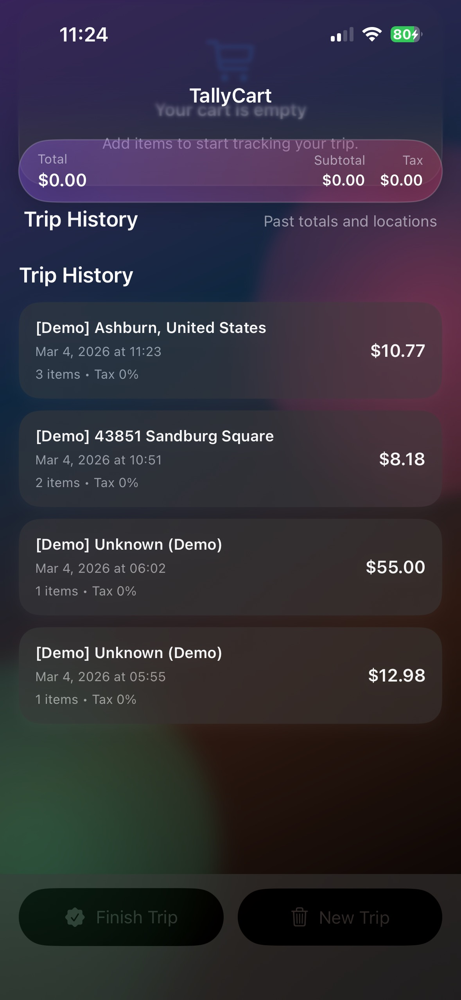
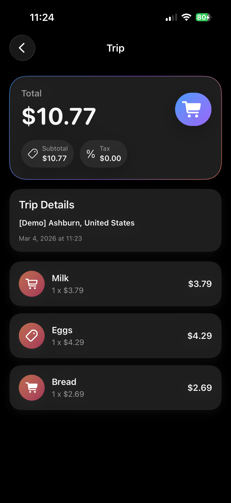
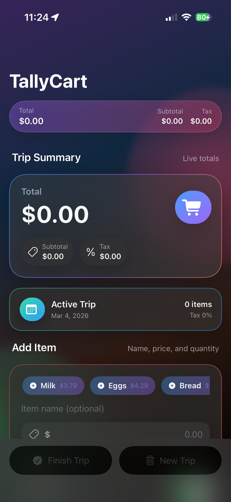

# TallyCart

Screenshots:   

A polished, single-screen iOS app for tracking a shopping trip with subtotal, tax, and total in real time. The experience is designed to feel like a finished product: clear hierarchy, bold materials, and smooth flows for adding items, reviewing a trip, and revisiting history.

## Features
- Sticky summary bar with live totals.
- Add item flow with validation and quick-add chips.
- Tax toggle with editable rate (defaults to Virginia 5.3%).
- Swipe-to-delete item rows with a refined reveal.
- Finish Trip review sheet before saving.
- Trip history with full detail view (back arrow + swipe back).
- Local persistence using `UserDefaults` + JSON.
- Light/Dark mode supported, with true black dark background.

## User Flow
1. Add items (optionally use quick-add chips).
2. Review totals at the top bar and header card.
3. Tap **Finish Trip** to review and save.
4. Open Trip History to revisit any past trip.

## Permissions
- Location (When In Use) is used to label trips with a nearby place name.

## How To Run
1. Open the Xcode project.
2. Select the **TallyCart** scheme and an iOS 17+ simulator or device.
3. Run.
